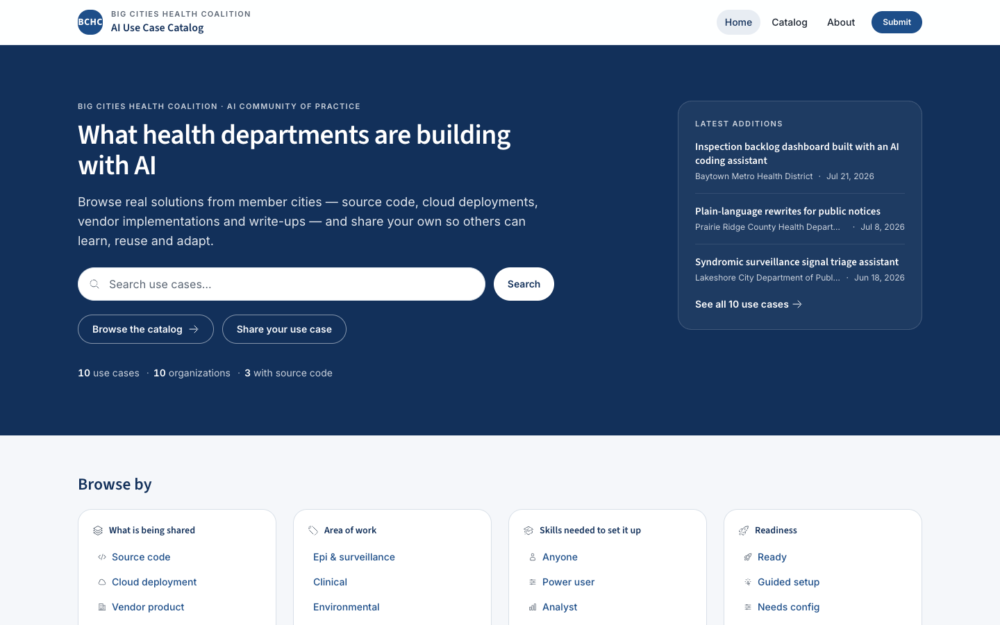
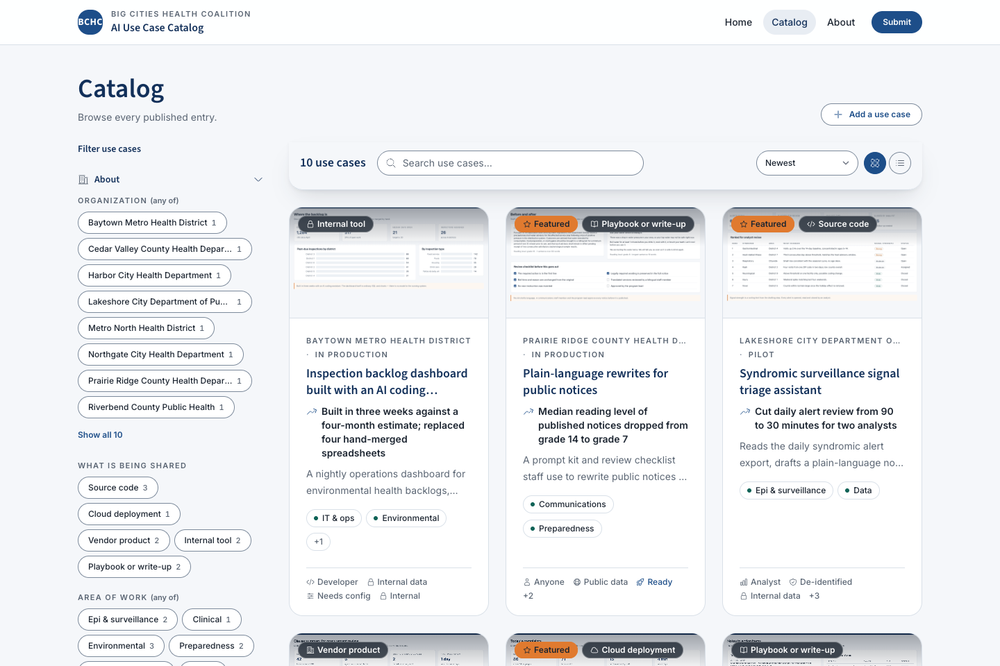
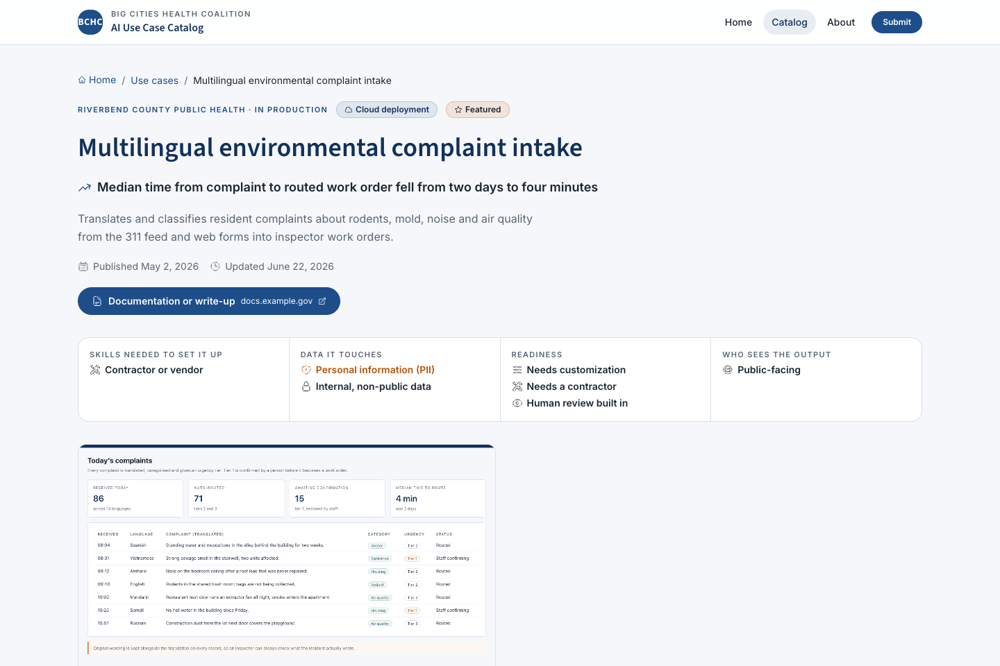

# Civic Catalog Template

A configurable, GitHub-Pages-hosted catalog and resource site, managed entirely through GitHub. There is no server, no database and no CMS login — Jekyll builds the site on GitHub Actions and deploys it to Pages, and every content change flows through a GitHub issue and a pull request.

This repository is shipped configured as the **Big Cities Health Coalition (BCHC) AI Use Case Catalog**, where member health departments share AI use cases — source repos, cloud deployments, vendor solutions, write-ups. The same template can be re-pointed at other uses without touching layout code: a project/asset portal, a cohort or training-program portal where teams publish outputs, an event calendar, or a curated resource library. See [`docs/configuration.md`](docs/configuration.md) for how to retarget it.

<p align="center">
  
</p>

| Catalog | Entry |
| --- | --- |
|  |  |

## Features

- **GitHub-as-CMS.** Anyone can propose an entry through a web form or a GitHub issue. Automation turns the issue into a pull request with the entry already drafted — screenshots downloaded into the entry folder and all — and a maintainer reviews and merges it.
- **Schema-driven content model.** One file, [`_data/schema.yml`](_data/schema.yml), defines every field an entry has, *and* how it is presented: which fields reach a catalog card and in which slot, which become filters, which appear in the sidebar, what each option's short label, icon and tone are. The submission form, the issue template, the cards, the filter rail, the search index, the wizard defaults and the validator all derive from it. See [`docs/content-model.md`](docs/content-model.md).
- **Built for evaluation, not browsing.** Cards are laid out to answer "could my team reuse this?" in about two seconds: a result line, a taxonomy chip family, and a signal strip for skills needed, data sensitivity, audience and readiness. Filters sit beside the results, restore from the URL, and announce their counts.
- **Screenshots and links as first-class fields.** An `images` field gives an entry a gallery with a keyboard-navigable lightbox and honest alt text; a `links` field carries labelled resources — a shared drive folder, a recorded demo, a vendor page — without needing a field per link.
- **Two configurators.** A no-terminal setup wizard at `/setup/` on the deployed site, and an equivalent CLI wizard (`npm run setup`). Both offer starting presets (AI use case catalog, cohort/program portal, resource library, blank) and write the same configuration files from the same shared logic.
- **Modules.** Turn catalog, submit, carousel, stats, events, cohorts and resources on or off independently; navigation and the home page adapt automatically, and pages under a disabled module are dropped from the build.
- **Theming.** Colors, fonts and corner rounding live in [`_data/theme.yml`](_data/theme.yml) and become CSS variables consumed by Tailwind — no CSS editing required for a rebrand. Every colour has one semantic job, so a re-skin cannot quietly break contrast.
- **Accessibility as a build rule, not a pass.** Nothing is signalled by colour or icon alone, every control has a visible focus ring and a ≥3:1 border, filter changes are announced once, and the whole catalog still works with JavaScript disabled.
- **CI content pipeline.** Front-matter and file-size validation on every pull request, automatic thumbnail generation from uploaded PDFs, and workflows that scaffold cohort years, events and schedule updates from issues.

## Quick start

1. **Use this template** on GitHub (or clone it) to create your own repository.
2. **Turn on the three settings**: Pages source (Settings → Pages → Source → **GitHub Actions**), pull requests for Actions (Settings → Actions → General → Workflow permissions → **Allow GitHub Actions to create and approve pull requests**), and the content labels (Actions tab → **Bootstrap labels** → *Run workflow*).
3. **Configure the site** — open `/setup/` on the deployed site for the browser wizard (no terminal), or run `npm install && npm run setup` locally. Both write `_data/site.yml`, `_data/theme.yml`, `_data/schema.yml`, `_data/navigation.yml`, `_config.yml` and `.github/ISSUE_TEMPLATE/new-entry.yml`, from the same four presets.
4. **Delete the ten sample entries** — they are fictional organizations and they go live with your site. `grep -rl 'sample: true' catalog/` lists them.
5. **Commit and push.** `Build & Deploy` publishes to `https://<owner>.github.io/<repo>/`, working out `url`/`baseurl` on its own (root domain for a `<owner>.github.io` repo or a `CNAME` file, `/<repo>` otherwise); an explicit `url` in `_config.yml` always wins.

Each of those steps has a detail you will want on the day: **[`docs/launch.md`](docs/launch.md)** is the full tutorial — the same path with what breaks if you skip a step, a first test submission end to end, and the pre-launch checklist.

## How content gets in

1. A contributor fills out the **Submit** form (`/submit/`) — one page, with a live preview of the card their entry will produce — or opens the **Submit a use case** GitHub issue form directly.
2. The form data becomes a GitHub issue labelled `content:new-entry`. Screenshots are dragged onto the issue at this point.
3. The `New entry from issue` workflow runs `scripts/new_entry_from_issue.mjs`, which reads `_data/schema.yml`, downloads any attached images into `catalog/<slug>/screenshots/` (up to 8 files, 15 MB total, PNG/JPEG/GIF/WebP), and opens a pull request containing `catalog/<slug>/index.md`.
4. Larger attachments — a `deck.pdf` — are added to the entry folder directly in that pull request. Any `file` field flagged `thumbnail: true` gets a `thumb.jpg` rendered from its first page automatically by the `Generate entry thumbnails` workflow.
5. A maintainer reviews the entry against the checklist in [`docs/admin-guide.md`](docs/admin-guide.md) — plain language, no protected data on screen, alt text present, links that open for outsiders — and merges. The site rebuilds and the entry is live within a couple of minutes.
6. Existing entries can also be edited directly on GitHub — every entry page has a **Suggest an edit on GitHub** link.

### What an entry holds

The shipped AI use case schema has 26 fields in six groups. In outline:

| Group | Fields |
|---|---|
| About | title, one-sentence summary, result in one line, organization, what is being shared, area of work, stage |
| How it's built | how AI is involved, types of AI, AI tools & models, where it runs, vendor or partner |
| Reuse | skills needed to set it up, readiness, source code, live demo, documentation, other resources, screenshots, slide deck |
| Data & access | data it touches, data sources, who sees the output |
| Contact | contact name, contact email |
| The story | the full write-up, which becomes the page body |

Every one of those is a line in `_data/schema.yml` and none of them is named anywhere else — rename, remove or replace the lot for a different subject and the forms, filters, cards and validator follow. [`docs/content-model.md`](docs/content-model.md) documents each property, the `images` and `links` shapes, and how to design a taxonomy that people actually filter by.

Cohorts and events follow the same issue → automation → pull request pattern (`content:new-year`, `content:schedule`, `content:event-attachments`, and the plain **Add event details** issue). See [`docs/admin-guide.md`](docs/admin-guide.md) for the maintainer side of all of this.

## Configuration overview

- **Branding, contact info, module toggles, home page copy** — `_data/site.yml`
- **Colors, fonts, corner rounding** — `_data/theme.yml`
- **Header navigation** — `_data/navigation.yml` (regenerated by the wizards from your modules, but hand-editable)
- **The entry content model** — `_data/schema.yml` (see [`docs/content-model.md`](docs/content-model.md))
- **Events, cohort years, resource library** — `_data/events.yml`, `_data/cohorts/<year>.yml`, `_data/resources.yml`

Full reference for every setting: [`docs/configuration.md`](docs/configuration.md). Every other document, and who each one is for: [`docs/index.md`](docs/index.md).

## Local development

Requires Ruby 3.3 (see `.ruby-version`) and Node 22+.

```bash
bundle install
npm install

npm run dev       # http://127.0.0.1:4000/ with live reload — Tailwind watcher + jekyll serve in one terminal,
                  # regenerating the schema-derived files whenever _data/schema.yml or _data/site.yml changes
npm run build     # generate schema-derived files, build CSS, build the Jekyll site into _site/
```

`npm run dev -- --port 4001 --host 0.0.0.0` changes where it listens; output is prefixed `[css]`, `[jekyll]` and `[gen]`, and Ctrl-C stops everything. `npm run serve` and `npm run watch:css` still exist if you want the pieces separately.

Other useful scripts:

```bash
npm run setup      # configuration wizard (see Quick start)
npm run generate   # regenerate the issue template + configurator defaults, and sync _config.yml from _data/site.yml
npm run validate   # parse all _data/*.yml and run the front-matter / file-size checks CI runs on pull requests
npm test           # Node unit tests; `npm run test:ruby` for the Ruby validators
npm run test:build # build every preset and module combination and check the rendered copy (needs Ruby; minutes, not seconds)
npm run a11y       # pa11y-ci (WCAG 2 AA) against _site served on :4173 — see CONTRIBUTING.md
npm run lighthouse # Lighthouse CI against the same local server
```

Contributing to the template itself? Start with [`CONTRIBUTING.md`](CONTRIBUTING.md) and [`ARCHITECTURE.md`](ARCHITECTURE.md).

## Repository layout

```
_config.yml              Jekyll build mechanics (title/description fall back to _data/site.yml)
_data/                   site.yml, theme.yml, schema.yml, navigation.yml, events.yml, resources.yml, cohorts/<year>.yml
_layouts/, _includes/    schema-driven templates (entry cards, filters, field rendering, etc.)
_plugins/                schema_filters.rb (card/weight/group/option_meta rules), theme_filters.rb, search_index.rb (/search.json), events.rb, modules.rb
assets/js/configurator/  shared logic behind both configurators (core.js, presets/, setup-page.js + steps/ + wizard/)
assets/js/submit.js      turns the /submit/ form into a pre-filled GitHub issue URL
scripts/                 setup.mjs, generate.mjs, validate.mjs, and the issue-to-PR automation scripts
.github/workflows/       pages, validate, quality (a11y + Lighthouse), smoke, new-entry, thumbnails, new-year, new-event, update-schedule, update-event-attachments
.github/ISSUE_TEMPLATE/  new-entry.yml is generated — do not hand-edit it, run `npm run generate`
catalog/<slug>/index.md  published entries; screenshots live in catalog/<slug>/screenshots/
                         (ten sample entries ship with the template, marked `sample: true`)
cohorts/<year>/          cohort landing page + event pages (module: cohorts)
styleguide/              /styleguide/ — live rendering of the design system against your theme (noindex)
docs/                    index.md (start here), launch.md, admin-guide.md, incidents.md, configuration.md,
                         content-model.md, decisions.md, glossary.md, design-brief.md, design-system.md, roadmap.md
quality/                 pa11y-ci and Lighthouse CI config, plus urls.js (shared URL discovery for both)
test/                    configurator/, plugins/, scripts/ and fixtures/ — Node's test runner + Ruby minitest
ARCHITECTURE.md          how the pieces fit; CONTRIBUTING.md — working on the template itself; SECURITY.md
```

## License

MIT — see [`LICENSE`](LICENSE).
