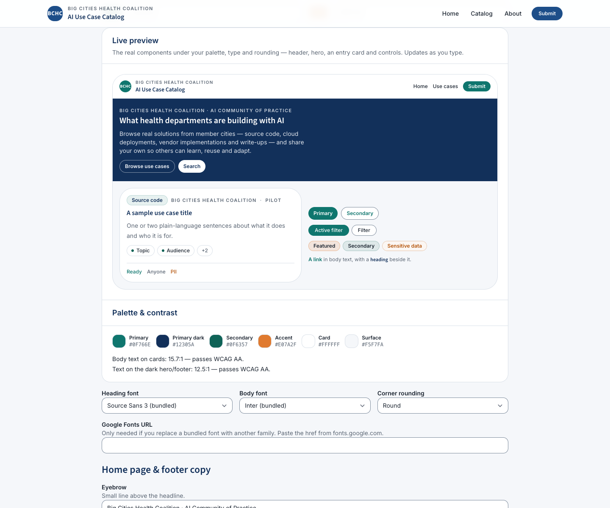
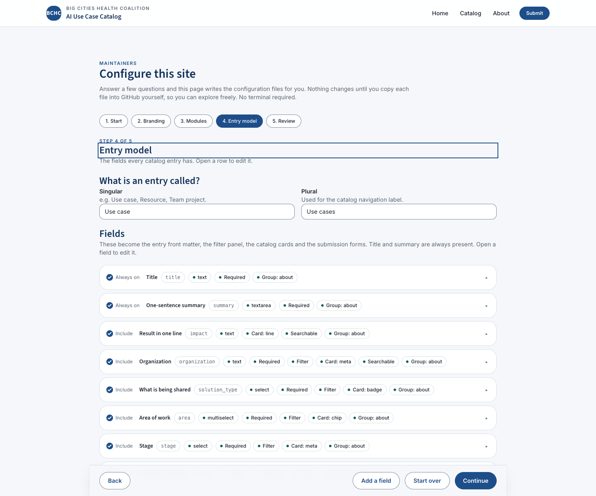

# Configuration reference

Everything that controls branding, theming, navigation and modules lives in `_data/*.yml`. `_config.yml` is kept to Jekyll build mechanics (plugins, excludes, permalink style) — its `title`/`description` are SEO fallbacks kept in sync with `_data/site.yml` by `npm run generate` and the setup wizards.

You can edit these files by hand, or use one of the two configurators described at the end of this page.

## `_data/site.yml`

### Identity

| Key | Purpose |
|---|---|
| `name` | Site name, used in the header/footer and page titles. |
| `tagline` | Short line under the site name. |
| `description` | Used for SEO tags and the RSS feed; also copied into `_config.yml`. |
| `organization.name` / `short_name` / `url` / `contact_email` | Shown in the header eyebrow, footer, about page, and as the email fallback for submissions. |
| `logo.image` | Path to an SVG/PNG under `assets/images`, or blank. |
| `logo.text` | Text mark shown when `logo.image` is blank. |

### GitHub repository

```yaml
github:
  repository: "owner/repo"
  branch: "main"
```

Used to build the `/submit/` form's GitHub issue URL, the "Suggest an edit on GitHub" and "Report an issue" links on entry pages, and the "Watch the repository" links throughout. **Update this after using the template** — it does not infer itself from where the site is actually hosted (the setup wizards do try to detect it from your git remote or `github.repository_nwo`, but hand-edits do not).

### Modules

```yaml
modules:
  catalog: true      # Browsable, filterable catalog of entries (the core)
  submit: true        # Public "Submit an entry" web form -> GitHub issue -> PR
  carousel: true       # Featured entries carousel on the home page
  stats: true       # Headline numbers on the home page
  events: true      # Events calendar (agenda list) from _data/events.yml
  cohorts: true     # Cohort / program-year pages with timelines & materials
  resources: false      # Curated resource library from _data/resources.yml
```

Each toggle does three things:

1. Removes (or restores) the module's link from the header, via `_data/navigation.yml`'s `module:` key.
2. Shows or hides the module's block on the home page (`index.md` checks `cfg.modules.<name>`).
3. **Removes the module's pages from the build entirely.** `_plugins/modules.rb` runs on `post_read` and drops any page whose URL starts with the module's path prefix when that module is off — those pages are not built, not in the sitemap, and not in `search.json`. Prefixes come from `_data/modules.yml` (`/cohorts/`, `/events/`, `/resources/`, `/submit/`); `catalog`'s prefix is derived from the schema's `entry.path` instead, since it has to track the configured entry folder. Turning the module back on brings its pages back on the next build without further changes.

The shipped BCHC configuration has `catalog`, `submit`, `carousel` and `stats` on, and `events`, `cohorts` and `resources` off. Sample data for the three off-by-default modules still ships in `_data/`, so turning one on gives you something to look at immediately.

### Home page copy

```yaml
hero:
  eyebrow: "…"
  title: "…"
  lead: "…"
  primary_cta:   { label: "…", url: "/catalog/", module: catalog }   # `module` is optional:
  secondary_cta: { label: "…", url: "/submit/",  module: submit }    # the button hides while that module is off

home:
  featured_count: 6   # entries shown in the carousel (featured: true first, then newest, until this many)
  recent_count: 6     # entries shown in the "Recently added" grid (see note below)
  hero_latest_count: 3 # newest entries listed beside the hero at ≥1024px (0 hides the panel)
  highlights:          # optional 3-up value-proposition cards; leave the list empty to hide the section
    - eyebrow: "…"
      title: "…"
      body: "…"
```

When the hero panel and the featured carousel are both on, the "Recently added" grid is shown only below 1024px — at desktop widths the hero list already carries the newest entries and the carousel already shows cards, so the grid would say "new" a third time above the fold. Set `hero_latest_count: 0` (or turn the `carousel` module off) to get the grid back at every width.

The home page also shows a headline stat block (module: `stats`), an entries-by-facet browse grid (up to four facet fields with fixed options — the ones also shown on the card as a badge, chip or signal glyph come first, in schema order, and other facets fill the remaining tiles), and an events/cohorts summary row — all computed automatically from the schema and data, nothing further to configure.

### Submit form copy

```yaml
submit:
  intro: "…"               # shown above the form
  review_note: "…"          # shown as step 3 of "what happens next"
  fallback_email: "…"       # used for the "Email it instead" button; blank hides the button
```

### Footer

```yaml
footer:
  about: "…"
  links:
    - { label: "…", url: "…" }
  copyright: "…"
```

### Analytics

```yaml
analytics:
  plausible_domain: ""   # e.g. "catalog.example.org" — leave blank to disable
```

When set, `_includes/head.html` injects the Plausible `<script data-domain>` snippet. No other analytics provider is wired up.

## `_data/theme.yml`

```yaml
colors:
  primary: "#1D4E89"        # interactive only: links, buttons, active filters, focus ring
  primary_dark: "#12305A"   # hero + footer ground, headings on light surfaces
  secondary: "#0F6357"      # taxonomy identity (chip dots, secondary icons); AA on white
  accent: "#E07A2F"         # "Featured" only
  ink: "#1B2430"            # body text
  muted: "#5A6573"          # secondary text (AA on white)
  line: "#D9E0E8"           # dividers and card borders
  line_strong: "#7C8A9B"    # borders of interactive controls — inputs, pills, checkboxes
  surface: "#F5F7FA"        # page background
  card: "#FFFFFF"           # card background
  on_dark: "#F7F9FC"        # text on primary_dark backgrounds
  warn: "#B45309"           # caution only: sensitive-data indicators, validation errors

fonts:
  heading: "Source Sans 3"   # bundled: "Inter" or "Source Sans 3"; any other name needs google_fonts_url
  body: "Inter"
  google_fonts_url: ""       # a Google Fonts <link> href, when using a non-bundled font

radius: "soft"                # sharp | soft | round
```

Colors are hex values. `_includes/theme.html` converts each one to an `R G B` triple (via the `hex_to_rgb` Liquid filter in `_plugins/theme_filters.rb`) and emits them as CSS custom properties (`--c-primary`, `--c-line-strong`, `--c-warn`, …) that Tailwind's `rgb(var(--c-x) / <alpha>)` utility classes read — so changing a hex value here re-themes the whole site on the next build, no CSS edits required. Keep text/background pairs at WCAG AA contrast (4.5:1 for body text); the setup wizards warn if `on_dark` on `primary_dark` falls under 4.5:1.

Each color has one job, and the templates rely on that (see [`docs/design-brief.md`](design-brief.md)):

| Token | Used for | Do not use it for |
|---|---|---|
| `primary` | Links, primary buttons, the active filter state, focus rings | Decorative fills or headings |
| `secondary` | Taxonomy identity — a chip's dot or icon | Tinted text on a tinted background |
| `accent` | The "Featured" marker | General emphasis |
| `warn` | Sensitive-data indicators, validation errors, anything a reader must not miss | Emphasis. If everything warns, nothing does. |
| `line` | Dividers and resting card borders | Input borders — they need `line_strong` |
| `line_strong` | Borders of controls the user can operate: inputs, filter pills, checkboxes | Dividers |

`line_strong` and `warn` exist for contrast reasons. WCAG requires non-text UI boundaries to reach 3:1, which `line` deliberately does not — it is a hairline. Any control a user can click or type into needs `line_strong` or darker.

`radius` maps to a five-step scale (`--radius-sm` … `--radius-2xl`) used across cards, buttons and inputs: `sharp` = 0.25 / 0.375 / 0.5 / 0.75 / 1 rem, `soft` = 0.5 / 0.75 / 1 / 1.25 / 1.75 rem, `round` = 0.75 / 1 / 1.5 / 2 / 2.5 rem (see `_includes/theme.html`).

Colours, fonts and radius are read at build time by `_includes/theme.html`, so a `theme.yml` edit shows up on the next Jekyll build with no CSS rebuild. `npm run build:css` is only needed when you change component CSS under `assets/css/` or `tailwind.config.js`.

### Elevation and motion

Not configurable in `_data/theme.yml`, but worth knowing before you write custom CSS: the design system uses exactly two shadows (`shadow-e1` for card hover, `shadow-e2` for sticky bars, sheets and popovers) and nothing else — structure comes from `line` and spacing. Motion is 120ms for state changes, 180ms for hover and expand, 240ms for a sheet, easing `ease-brand`, animating only `transform` and `opacity`. `prefers-reduced-motion` turns transforms and slides instant and stops carousel autoplay; colour and opacity transitions stay, and focus rings never animate.

### Light mode only

There is no dark palette and no `prefers-color-scheme` handling. A single set of tokens keeps every preset verifiable for contrast, and a template that re-skins for six different organizations is hard enough to keep accessible in one mode. If you need a dark site, invert the tokens themselves — `surface`, `card`, `ink`, `on_dark` — rather than adding a second theme.

## `_data/navigation.yml`

A flat list of header links:

```yaml
- label: Catalog
  url: /catalog/
  module: catalog   # optional — item is hidden when this module is off
  style: button       # optional — renders as a filled button instead of a text link
```

Regenerated by both setup wizards from your module toggles and entry naming, but safe to hand-edit afterwards (edits are not overwritten unless you re-run a wizard).

## Modules in detail

| Module | Turns on | Turns off / removes when disabled |
|---|---|---|
| `catalog` | The entry grid, filters and search at `/<entry.path>/` (default `/catalog/`) | All entry pages and the catalog index are dropped from the build |
| `submit` | `/submit/` web form | The submit page and its nav link |
| `carousel` | Featured-entries carousel on the home page | (home page section only; no pages removed) |
| `stats` | Headline stat block in the hero | (home page section only) |
| `events` | `/events/` calendar, home page "Upcoming events" card | Event pages under `/events/` |
| `cohorts` | `/cohorts/` index and `/cohorts/<year>/` pages, cohort filter facet on entries with a `cohort` field | All cohort and cohort-event pages |
| `resources` | `/resources/` curated link library from `_data/resources.yml` | The resources page |

## The two configurators

Both read/write the same six files (`_data/site.yml`, `_data/theme.yml`, `_data/schema.yml`, `_data/navigation.yml`, `_config.yml`, `.github/ISSUE_TEMPLATE/new-entry.yml`) using the same shared logic in `assets/js/configurator/core.js`, so they always produce equivalent output.

Their starting point — the defaults both wizards open with — is not hand-maintained JavaScript. `assets/js/configurator/defaults.generated.js` is produced from `_data/site.yml`, `_data/theme.yml`, `_data/schema.yml` and `_data/navigation.yml` by `npm run generate`, so the wizards can never drift from the YAML that actually builds the site. Do not edit it; a `--check` run in CI fails the build if it is stale.

### `/setup/` — browser wizard

A no-terminal step-by-step wizard on the deployed site (`setup/index.md` + `assets/js/configurator/setup-page.js`), for maintainers without local dev tooling. It:

- Loads the site's current configuration (embedded as JSON in the page) so you're editing forward from what's live, not starting over.
- Offers the same four presets as the CLI: **AI use case catalog**, **Program / cohort portal**, **Resource library**, **Blank catalog**.
- Lets you edit branding, colors/fonts, module toggles, and the schema's field list (including adding/renaming/removing fields) with validation.
- Shows a **live preview** on the Branding step — a miniature of the real header, hero, entry card and controls, rendered from the production stylesheet under your palette, type and corner rounding — next to the palette swatches and WCAG contrast checks. It updates as you type.
- Lists the entry model's fields as **collapsed rows** — one summary line each (label, key, type, and badges for required / filter / card / searchable / group) behind an expand button. Only the row you open shows its controls, so the step stays a screen or two rather than a mile of form. Open rows stay open as you edit, and a validation error re-opens the row it blames.
- Keeps that step's actions (**Add a field**, **Back**, **Continue**) pinned to the bottom of the viewport, so you never have to scroll back up to move on.
- Lets each field's **Show on card** toggle also pick the card slot (`badge`, `meta`, `line`, `chip`, `icon`) when the field's type fits one; leave it on **Automatic** to let the card choose from the type. See `card` in `docs/content-model.md`.
- Lets each field pick its **group** (which entry-page section it renders in) and its **weight** (1-9, ordering within the group) — the same `group`/`weight` keys documented in `docs/content-model.md`, both on existing fields and on the add-a-field form.
- Reports validation problems in a single **error summary** that takes focus when you try to continue, with one link per problem that jumps to the control at fault.
- Saves your answers in the browser as you go (a resume banner appears if you return with unfinished progress).
- Produces copy/download/"open in GitHub, pre-filled" links for each generated file — nothing is pushed automatically; you commit the files yourself via the GitHub UI or by pulling them locally.

| Branding step | Entry model step |
| --- | --- |
|  |  |

### `npm run setup` — CLI wizard

```bash
npm run setup                          # interactive, asks every question
npm run setup -- --preset ai-use-cases # start from a preset instead of choosing interactively
npm run setup -- --yes                 # accept every default, ask nothing (good for CI / smoke tests)
npm run setup -- --dry-run             # print the file list and a diff summary; write nothing
npm run setup -- --out <dir>           # write the files into <dir> instead of the repo (implies --yes)
npm run setup -- --help
```

Same four presets (`ai-use-cases`, `cohort-portal`, `resource-library`, `blank`). Detects `owner/repo` from your git remote as the default for the repository question. Writes files directly to disk after you confirm a diff summary. Preserves any hand-added lines in `_config.yml` outside the title/description fields it owns.

After hand-editing any `_data/*.yml` file directly (without going through either wizard), run `npm run generate`. It regenerates `.github/ISSUE_TEMPLATE/new-entry.yml` and `assets/js/configurator/defaults.generated.js`, and resyncs `_config.yml`'s title and description. It is idempotent, and `npm run generate -- --check` is the CI gate that fails when a generated file is out of date — so regenerate and commit in the same change.
